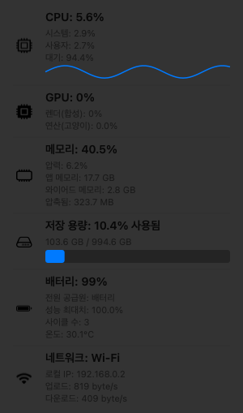

# 바쁘냥 (BusyCat)

[RunCat](https://github.com/Kyome22/menubar_runcat)처럼 메뉴바에서 고양이가
달리는데, **얼마나 바쁜지에 따라 속도가 변하는** macOS 메뉴바 앱입니다. RunCat과
달리 바쁘냥은 **CPU뿐 아니라 GPU도 함께** 봅니다 — ML 학습·임베딩·렌더링 같은
무거운 GPU 작업에도 고양이가 빨라집니다.

🇺🇸 [English README](README.md)


## 왜 만들었나

RunCat은 CPU만 봐서, GPU를 쓰는 작업(예: Apple Silicon에서 ML 임베딩 돌릴 때)에는
고양이가 한가해 보입니다. 바쁘냥은 **`max(CPU, GPU)`** — 둘 중 더 바쁜 쪽으로
고양이를 달리게 합니다.

RunCat이 GPU를 못 넣는 건 **앱스토어 = 샌드박스** 앱이라 GPU·온도 정보 접근이
막혀 있기 때문입니다(개발자가 FAQ에서 명시). 바쁘냥은 앱스토어 **밖** 빌드라 IOKit으로
`sudo` 없이 GPU를 읽을 수 있습니다.

## 기능

- 메뉴바에서 달리는 고양이, 속도 ∝ 시스템 부하.
- **CPU와 GPU**를 함께 감시. 속도 기준 선택: 가장 바쁜 쪽(CPU·GPU) / CPU / GPU /
  메모리.
- **상세 패널**(고양이 클릭): CPU · GPU · 메모리 · 디스크 · 네트워크 · 배터리 —
  각각 활성 상태 보기(Activity Monitor)의 정의에 맞춤.
- 고양이 옆에 부하 **% 표시** 토글.
- 속도 반전(바쁘면 느리게), 좌우 반전, 고양이 색(자동/흰색/검정) 선택.
- **가벼움:** idle CPU ~0.1% — 더 많은 걸 보면서도 RunCat보다 가볍습니다.
- Dock 아이콘 없음(`LSUIElement`). 설정은 `UserDefaults`에 저장(재실행해도 유지).

<p align="center"></p>

## 빌드 / 설치

macOS Swift 툴체인(Xcode Command Line Tools)만 있으면 됩니다. 추가 의존성 없음.

```bash
./make_app.sh            # BusyCat.app 빌드 (애드혹 서명)
./make_app.sh --install  # 빌드 + /Applications 복사 + 재실행
```

종료는 고양이 메뉴 → **바쁘냥 종료** (⌘Q). 로그인 시 자동 실행은 시스템 설정 →
일반 → 로그인 항목에 `BusyCat.app` 추가.

## 업데이트

**자동 업데이트는 없습니다** — 앱스토어 앱이 아니라 애드혹 서명 앱이라서요. 업데이트하려면
받아서 다시 빌드합니다:

```bash
git pull
./make_app.sh --install   # 종료 → /Applications/BusyCat.app 교체 → 재실행
```

## 작동 원리

- **GPU** (Apple Silicon, `sudo` 불필요): IOKit `IOAccelerator` →
  `PerformanceStatistics`. 연산 부하 = `Device Utilization %` − `Renderer
  Utilization %`. 이렇게 빼면 순수 연산(Metal/MPS)이 그래픽/컴포지팅과 분리됩니다 —
  ML 작업 때 올라가는 게 바로 이 값이고, 활성 상태 보기와 교차검증했습니다.
- **CPU**: `host_statistics`의 `HOST_CPU_LOAD_INFO` 틱 델타. EMA로 부드럽게 해서
  활성 상태 보기와 비슷한 느낌으로.
- **메모리 / 디스크 / 네트워크 / 배터리**: `vm_statistics64`, 볼륨 용량,
  `getifaddrs` 바이트 델타, IOKit `AppleSmartBattery` — 각각 활성 상태 보기 정의에
  맞춤.
- **렌더링**: 타이머로 갈아끼우는 `CALayer` 스프라이트(최신 macOS의 무거운 메뉴바
  재합성 경로를 피함).
- **속도 공식**: `interval = 0.4 / clamp(usage / 5, 1...20)` → idle ~2.5fps,
  풀로드 ~50fps.

소스는 `Sources/BusyCat/`에 있습니다: `UsageReader.swift`(샘플러),
`AppDelegate.swift`(상태 아이템 + 애니메이션), `StatsView.swift`(패널),
`CatFrames.swift`(스프라이트).

## 출처 / 라이선스

- 코드: **MIT** — [LICENSE](LICENSE) 참고.
- 고양이 스프라이트: [RunCat](https://github.com/Kyome22/menubar_runcat)
  (Takuto Nakamura), **Apache License 2.0** —
  [THIRD_PARTY_LICENSE-RunCat.txt](THIRD_PARTY_LICENSE-RunCat.txt) 참고. 속도 매핑
  공식도 RunCat을 참고했습니다. `assets/cat0–4.png`가 원본 프레임이고, 앱 아이콘도
  여기서 만들었습니다.
