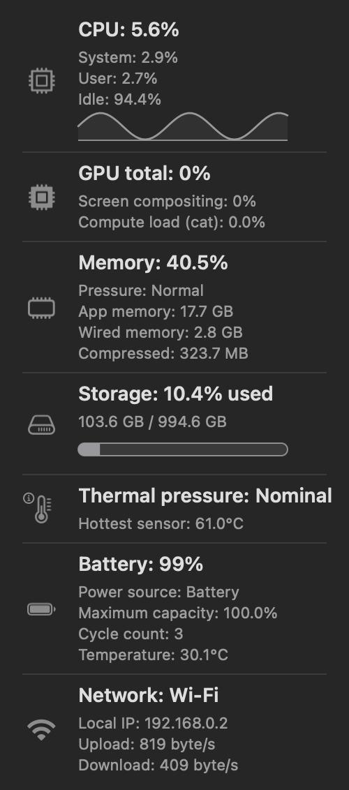

<p align="center"></p>

<h1 align="center">BusyCat (바쁘냥)</h1>

A macOS menu-bar app like [RunCat](https://github.com/Kyome22/menubar_runcat) — a
running cat whose speed reflects how busy your Mac is. Unlike RunCat, **BusyCat
watches GPU compute as well as the CPU**, so heavy GPU work such as ML training
and embeddings makes the cat run too.

🇰🇷 [한국어 README](README.ko.md)

<p align="center">
  <a href="https://github.com/mangomandu/busycat/releases/latest/download/BusyCat-1.1.5-macOS.dmg"><strong>Download for Apple Silicon Mac (.dmg)</strong></a>
  <br>
  <sub>Open the DMG, then drag <code>BusyCat.app</code> to <code>Applications</code>. See <a href="https://github.com/mangomandu/busycat/releases/latest">GitHub Releases</a> for release notes.</sub>
</p>

<p align="center"></p>

## Why

RunCat only watches the CPU, so GPU-bound work — for example running ML
embeddings on Apple Silicon — leaves the cat looking idle. BusyCat drives the cat
from **`max(CPU, GPU compute)`**: whatever is busiest. The GPU value excludes
graphics/display rendering and represents estimated compute load.

RunCat can't add GPU support because it's a sandboxed App Store app (no GPU or
thermal access — the developer says so in the FAQ). BusyCat ships *outside* the
App Store, so it can read the GPU via IOKit without `sudo`.

## Features

- Running cat in the menu bar, speed ∝ system load.
- Watches **CPU and GPU compute**. Pick what drives the speed: busiest
  (CPU·GPU compute), CPU only, GPU compute only, or memory.
- **Detailed live panel** (click the cat): CPU, GPU, memory, disk, thermal state,
  network, battery — each mapped to Activity Monitor's own definitions where
  macOS exposes a comparable value.
- **Temperature details on hover**: hottest sensor, macOS thermal pressure,
  `pmset` speed limits, and top temperature sensors are shown separately.
- Choose the menu-bar text: hidden, cat-speed %, CPU %, GPU compute %, memory %,
  temperature, or thermal pressure.
- Optional **memory-pressure fish pile** driven by macOS' real
  normal/warning/critical pressure state.
- Invert speed (busier = slower), flip the cat's direction, choose cat color
  (auto contrast / white / black). Optionally add a red outline to the cat when
  thermal pressure is above nominal.
- **Lightweight:** when the menu is closed, BusyCat reads only the values needed
  to drive the cat, keeping idle CPU low.
- No Dock icon (`LSUIElement`). Settings persist (`UserDefaults`).

<p align="center"></p>

## Menu Layout

Click the cat to open the menu. Items are ordered like this:

1. Current speed-driver summary
2. Detailed CPU/GPU/memory/disk/thermal/battery/network panel
3. Settings
4. Open Activity Monitor
5. Check for updates
6. About BusyCat
7. Quit BusyCat

Use `Settings` to choose language, menu-bar display, speed behavior, design, and
launch at login in one place. Hover the thermal row in the stats panel to see
temperature sensor details. BusyCat ships Korean and English UI text only; the
default language is Korean for `ko` system languages and English otherwise.

## Default Settings

Fresh installs start quiet and conservative:

- Language: system language (Korean for `ko`, English otherwise)
- Speed source: busiest of CPU/GPU
- Menu-bar text: hidden
- Memory pressure fish: off
- Cat color: auto (match menu bar)
- Graph/bar color: graphite
- Speed invert: off
- Flip direction: off
- Red thermal outline: off
- Launch at login: off

## 🧪 Experimental: multi-cat mode

A multi-cat mode is prototyped and working — a separate **CPU cat** and **GPU cat**
each spinning at its own load. Public release of this mode is on hold pending
artwork licensing: the prototype used a popular meme-cat sprite, so the
distributed build ships only with the licensed running-cat art and the
hand-drawn memory fish gauge for now. If you're the rights holder and object,
open an issue and it'll be removed.

## Install

For regular users:

The current build requires an **Apple Silicon Mac (M1 or newer) running macOS 13
Ventura or later**. Intel Macs are not supported.

1. Download the latest DMG:
   [BusyCat-1.1.5-macOS.dmg](https://github.com/mangomandu/busycat/releases/latest/download/BusyCat-1.1.5-macOS.dmg)
2. Open the DMG.
3. Drag `BusyCat.app` to `Applications`.

Release page:
[github.com/mangomandu/busycat/releases/latest](https://github.com/mangomandu/busycat/releases/latest)

Homebrew is available for terminal-friendly users:

```bash
brew tap mangomandu/busycat https://github.com/mangomandu/busycat
brew install --cask busycat
```

If Homebrew reports that the tap is untrusted, trust it once and retry:

```bash
brew trust mangomandu/busycat
brew install --cask busycat
```

BusyCat is not notarized yet. On first launch, macOS may block it; if that
happens, open System Settings → Privacy & Security and choose **Open Anyway**.

Developers and terminal-friendly users can also build BusyCat from source. Since
the app is built locally on your Mac instead of being opened as a downloaded app,
this can avoid the macOS security warning attached to unsigned downloads.

```bash
git clone https://github.com/mangomandu/busycat.git
cd busycat
./make_app.sh --install
```

This requires Xcode Command Line Tools.

## Build & package

Requires the macOS Swift toolchain (Xcode Command Line Tools). No other
dependencies.

```bash
./make_app.sh            # build BusyCat.app (ad-hoc signed)
./make_app.sh --install  # build + copy to /Applications + relaunch
./make_dmg.sh            # build BusyCat-...-macOS.dmg
./tools/render_stats_panels.sh  # regenerate Korean/English README panels
```

Quit from the cat's menu → **Quit BusyCat** (⌘Q). Enable launch at login under
**BusyCat Settings → System → Launch at login**.

## Updating

BusyCat checks GitHub Releases once a day; when a newer version is published it
shows **🆕 Get v...** in its menu (or click **Check for Updates** any time). It only
*notifies* — there's no Sparkle/auto-install — so you update by downloading the
new DMG and replacing the app in `Applications`.

If you build from source:

```bash
git pull
./make_app.sh --install   # quits, replaces /Applications/BusyCat.app, relaunches
```

## How it works

- **GPU compute** (Apple Silicon, no `sudo`): IOKit `IOAccelerator` →
  `PerformanceStatistics`. Compute load = `Device Utilization %` − `Renderer
  Utilization %`, which isolates real compute (Metal/MPS) from
  graphics/display rendering — this is what climbs during ML work, cross-checked
  against Activity Monitor.
- **CPU**: `host_statistics` `HOST_CPU_LOAD_INFO` tick deltas, EMA-smoothed so it
  tracks Activity Monitor's feel.
- **Memory / disk / network / battery / thermal state**: `vm_statistics64`,
  volume capacity, `NET_RT_IFLIST2` 64-bit byte deltas, IOKit `AppleSmartBattery`,
  `ProcessInfo.thermalState`, IOHID/AppleSMC temperature sensors, and
  `pmset -g therm` where available.
- **Memory pressure**: the public Dispatch memory-pressure source provides the
  real normal/warning/critical state; BusyCat does not invent a percentage from
  unrelated VM counters.
- **Temperature vs thermal pressure**: the temperature shown in the menu is the
  hottest valid SMC/IOHID sensor. Thermal pressure is macOS' own
  `nominal / fair / serious / critical` state, which also reflects power,
  scheduling, and throttling headroom. A Mac can report 60-100°C while still
  being nominal, or throttle before a single sensor looks alarming.
- **Sampling optimization**: BusyCat warms the first detailed snapshot on a
  background queue after launch. While the menu is closed it then reads only the
  CPU/GPU-compute/memory values needed to drive the cat. Detailed sensors refresh
  while the menu is open; slow-changing values are cached for about 5 seconds,
  and `pmset -g therm` is
  cached for about 30 seconds.
- **Accuracy caveats**: GPU compute load is a best-effort interpretation of Apple
  Silicon IOKit counters, and temperature sensor names are model-specific rather
  than stable public API. BusyCat therefore shows temperature as the hottest
  valid sensor it can read, while macOS thermal pressure remains the primary
  signal for real throttling pressure.
- **Rendering**: a `CALayer` sprite swapped by a timer (avoids the heavy menu-bar
  recomposite path on recent macOS).
- **Speed**: `interval = 0.4 / clamp(usage / 5, 1...20)` → ~2.5 fps idle,
  ~50 fps at full load.

Source lives in `Sources/BusyCat/`: `UsageReader.swift` (sampler),
`AppDelegate.swift` (status item + animation), `StatsView.swift` (panel),
`CatFrames.swift` (sprites).

## Credits & license

- Code: **MIT** — see [LICENSE](LICENSE).
- Cat sprites: from [RunCat](https://github.com/Kyome22/menubar_runcat) by Takuto
  Nakamura, **Apache License 2.0** — see
  [THIRD_PARTY_LICENSE-RunCat.txt](THIRD_PARTY_LICENSE-RunCat.txt). The
  speed-mapping formula is also adapted from RunCat. `assets/cat0–4.png` are the
  original frames; the app icon is derived from them.
